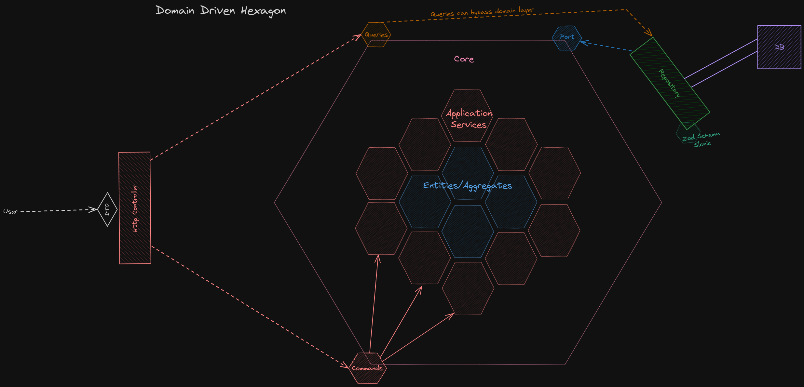

# Nest.js Hexagonal Architecture Todo App

This is a Nest.js backend exposing endpoints to `http://localhost:3000`. It's an overengineered todo app used to explore concepts of:
  - Clean Architecture
  - Hexagonal Architecture
  - CQRS pattern
  - SOLID principles
  - DDD
  - Event driven design

These concepts only make sense while dealing with a very large codebase developed by a several people at the same time.

The stack used in this project is the following:
  - Nest
  - PostgresSQL in docker container
  - Slonik for query building
  - zod for creating table schemas in the codebase
  - jwt stored in cookies for the authentication

## Actual structure of project

## How to run
1. Install packages with: `npm install`
2. Start docker container for Postgres: `npm run docker:env`
3. Then start the app with hot reloading: `npm run start:dev`

## Resources used for this project
- [Bitloops Todo App](https://github.com/bitloops/ddd-hexagonal-cqrs-es-eda)
- [Domain Driven Hexagon](https://github.com/Sairyss/domain-driven-hexagon)
- [Backend Best Practices](https://github.com/Sairyss/backend-best-practices)